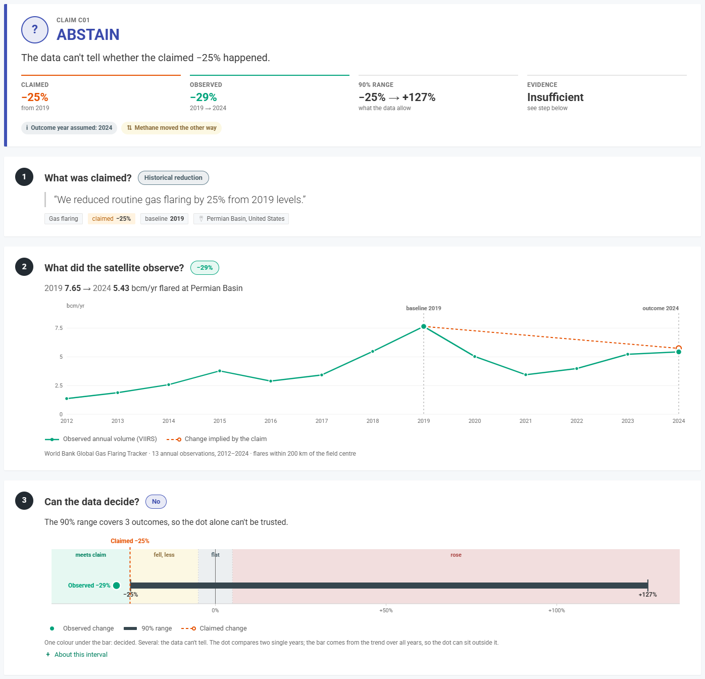
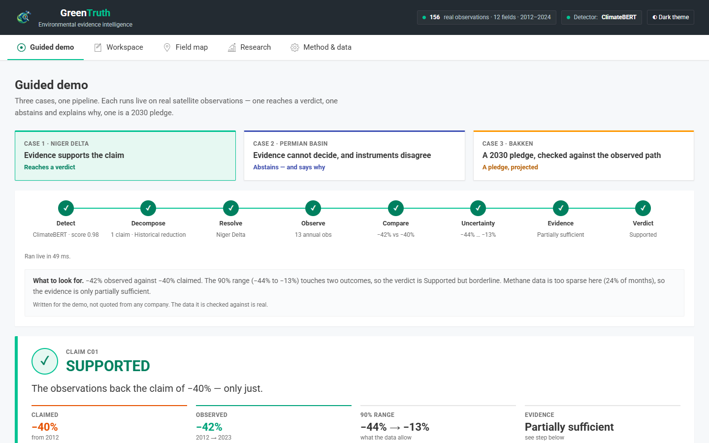
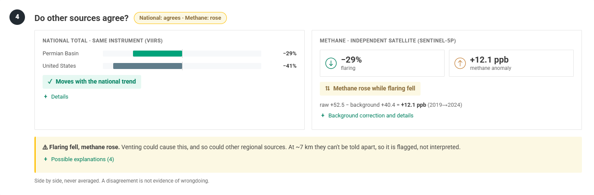
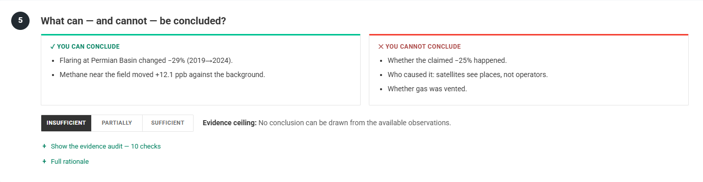
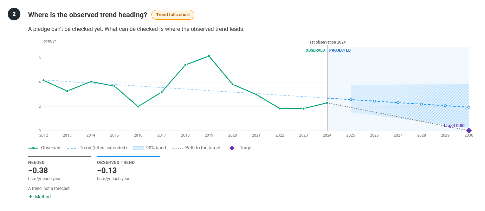
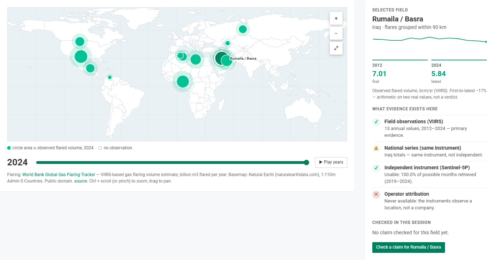
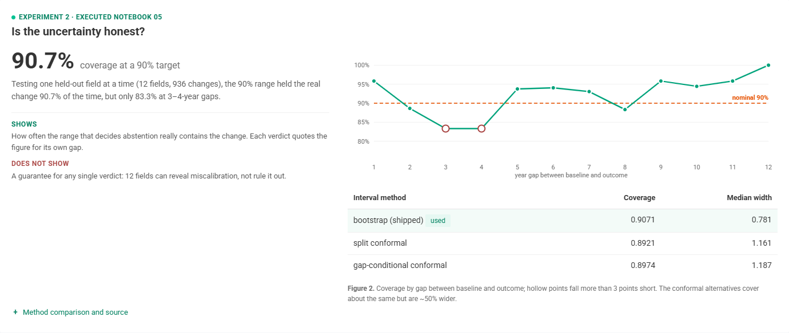

<p align="center"></p>

# GreenTruth

**Ground environmental claims in satellite evidence.**

GreenTruth is an uncertainty-aware environmental claim verification prototype that
compares checkable gas-flaring claims against real Earth-observation data.

When the evidence cannot distinguish between materially different outcomes,
GreenTruth abstains instead of forcing a verdict.



> **Research prototype.** One claim type — gas flaring — is checked end to end, for 12
> major flaring regions, against real public satellite-derived data. GreenTruth states
> whether a claim is *consistent with observations*; it never judges a company and never
> attributes a change to an operator.

---

## One-line description

A report goes in; each checkable flaring claim comes out compared with real VIIRS
observations, with an uncertainty interval, an evidence-sufficiency audit, and a verdict —
or an explicit abstention when the data cannot decide.

## Why GreenTruth?

Organisations publish environmental claims such as *"we reduced routine flaring by 40%
since 2019"* or *"zero routine flaring by 2030"*. Text tools can already **detect** such
claims; detecting a claim is not checking it. Satellites observe gas flaring worldwide, but
the observations are annual, noisy, and tied to *locations* rather than *operators*. A
useful checker therefore has to compare the claim with the observations **and** state how
much that comparison can support — including when it supports nothing.

## What makes it different?

1. **Real Earth-observation evidence.** Flaring volumes from the World Bank Global Gas
   Flaring Tracker (VIIRS satellite instrument), plus Sentinel-5P methane as a second,
   independent instrument. There is no synthetic environmental data anywhere in the app.
2. **Uncertainty decides the verdict.** A 90% interval is computed around every observed
   change and selects the verdict — the point estimate alone never does.
3. **Abstention is a result.** When the interval spans materially different outcomes
   (for example "met the claim" through "rose"), the answer is *abstain*, with the reason.
4. **Past results and future pledges are different objects.** A historical claim is
   compared with observations; a pledge is projected from the observed trend and drawn in
   a style that can never be mistaken for a measurement.
5. **Evidence sufficiency.** Every claim gets an audit — *sufficient / partially sufficient /
   insufficient* — listing what the evidence supports, what it supports only with a
   limitation, what it cannot establish, and an explicit **evidence ceiling**.
6. **Cross-scale and cross-sensor checks.** The field is compared with its national total
   (same instrument, labelled *not independent*) and with the background-corrected methane
   anomaly (a different satellite). Disagreement is shown, never averaged away.
7. **Transparent provenance.** Every number carries its dataset, provider, licence and
   processing step, and a 13-step evidence chain can be inspected node by node.

## How it works

```
Report
  ↓  Claim detection        ClimateBERT (fine-tuned), or a transparent rule-based fallback
  ↓  Decomposition          one sentence → atomic claims; past result ≠ future pledge
  ↓  Field resolution       claim → monitored field → real coordinates (ambiguity surfaced)
  ↓  Earth observation      real annual VIIRS flaring series for the field, 2012–2024
  ↓  Trend + uncertainty    observed change + 90% interval · or a projection for a pledge
  ↓  Cross-check            national total (same instrument) · Sentinel-5P methane (independent)
  ↓  Evidence sufficiency   checklist + evidence ceiling
  ↓  Verdict                consistency statement — or abstain
```

Standard-library Python backend (`server.py` + the `greentruth/` package) and a
dependency-free web interface (`web/`). Details: [docs/ARCHITECTURE.md](docs/ARCHITECTURE.md).

## Demo

```bash
git clone https://github.com/RahilGhanem/GREEN-TRUTH.git greentruth && cd greentruth
python server.py            # Python 3.8+, no install needed
```

Open **http://localhost:8000** → **Explore Demo**. The three real-data CSVs the app reads
are committed in `data/real/`. If they are missing, the app starts and says the evidence is
unavailable instead of inventing any. To run it on Vercel, see [Deployment](#deployment).

| Case | Field | Claim (written for the demo) | What happens |
|---|---|---|---|
| 1 · Evidence supports the claim | Niger Delta | "reduced routine gas flaring by 40% by 2023 from 2012 levels" | observed −42%, 90% interval −44% to −13% → **Supported**, evidence *partially sufficient* (no independent instrument: methane retrievals too sparse here) |
| 2 · Uncertainty causes abstention | Permian Basin | "reduced routine gas flaring by 25% from 2019 levels" | point estimate −29%, but interval −25% to +127% → **Abstain**; methane anomaly +12.1 ppb while flaring fell (cross-sensor tension, flagged, not attributed) |
| 3 · A 2030 pledge | Bakken | "…will eliminate routine flaring by 2030" | projected 2030 value 1.94 bcm/yr (band 0.21–3.84) vs target 0 → **Not on observed trajectory** |

The claim wording is written to exercise the pipeline and is not quoted from any company;
the fields, the observation series and every number returned are real.
A five-minute judge walkthrough is in **[DEMO.md](DEMO.md)**.

### The interface

Five views: **Guided demo** (the three cases above, with a pipeline stepper and a *Next*
button between them), **Workspace** (paste any report, pick a field), **Field map**,
**Research** (the three measured experiments) and **Method & data**.

Every checked claim is shown as the same short evidence story. It opens with a verdict
banner (one plain sentence, the claimed / observed / 90% range / evidence figures, and any
warning flags). Then come five questions, each with a short answer beside it, so the titles
alone tell the story:

1. *What was claimed?*
2. *What did the satellite observe?*
3. *Can the data decide?*
4. *Do other sources agree?*
5. *What can — and cannot — be concluded?*

For a pledge, *Where is the observed trend heading?* replaces steps 2–4. Raw metadata stays
behind *Technical details* toggles. The 13-step trace from sentence to verdict is optional
and collapsed by default. Every view works at phone width.

| | |
|---|---|
|  |  |
| *Guided demo — case 1 reaches a borderline Supported verdict* | *Case 2 — flaring fell while the methane anomaly rose: flagged, not interpreted* |
|  |  |
| *What the evidence can and cannot support, and its ceiling* | *Case 3 — a pledge is projected, never drawn as a measurement* |
|  |  |
| *Field map — which evidence exists for each field* | *Research — measured coverage, including where it falls short* |

## Key measured results

Every figure below was produced by an executed notebook or evaluation script and is read
from `evaluation/`. Full tables and provenance: **[RESULTS.md](RESULTS.md)**.

| What was measured | Result | What it means |
|---|---|---|
| Claim detection, macro-F1 (265 held-out sentences) | **ClimateBERT 0.8813** · rule-based 0.6217 | how well claims are *found* — not whether they are true |
| Claim recall | **ClimateBERT 0.8955** · rule-based 0.2687 | the rules miss most claims outside their vocabulary; hence they are only the fallback |
| Empirical coverage of the shipped 90% interval (leave-one-field-out, 12 fields, 936 observations) | **0.9071** | conformal variants: 0.8921 and 0.8974, at ~50% wider intervals |
| Coverage by year gap | 0.833 (3–4 yr) to 1.000 (12 yr) | why each verdict quotes the coverage measured at its own gap |
| Ablation on 518 probe claims from real windows | **475 of 518 (91.7%)** withheld | see note below |
| Abstention by claim length | 92–97% for 3–8-year windows, 74–80% for 9–12-year windows | longer claims are more decidable on annual data |
| Source disagreement (full system) | **30.1%** of assessed claims | independent views of the same field often disagree; single-source verdicts would be unsafe |

**What 91.7% means.** A configuration that decides from the point estimate alone issues a
verdict for all 518 probe claims. When the 90% interval is allowed to decide, 475 of those
claims (91.7%) are withheld as abstentions because their interval spans materially
different outcomes. It measures how often these observations are **too uncertain to settle
a claim**. It is **not** accuracy, a success rate, or verification correctness — a withheld
verdict is not a wrong one, and no labelled true/false corpus exists to measure accuracy.

## Data

| Dataset | Provider | Measures | Time | Spatial scale | Access / licence |
|---|---|---|---|---|---|
| [Global Gas Flaring Tracker](https://www.worldbank.org/en/programs/gasflaringreduction/global-flaring-data) | World Bank GFMR, with the Earth Observation Group (Colorado School of Mines) / NOAA | flared gas volume from VIIRS radiant heat at detected flares | annual, 2012–2024 | individual flares, grouped to 12 fields by radius (60–200 km); national totals | public download, no account; World Bank terms |
| [Sentinel-5P / TROPOMI CH4](https://developers.google.com/earth-engine/datasets/catalog/COPERNICUS_S5P_OFFL_L3_CH4) | Copernicus / ESA, via Google Earth Engine | column-averaged methane mixing ratio | monthly, 2019–2024 | ~7 km pixels, averaged over each field | free, Earth Engine account; Copernicus licence, attribution required |
| [environmental_claims](https://huggingface.co/datasets/climatebert/environmental_claims) | ClimateBERT (Stammbach et al.) | sentences labelled claim / not claim | — | — | CC BY-NC-SA 4.0 (the fine-tuned detector inherits it) |
| [Zero Routine Flaring by 2030](https://www.worldbank.org/en/programs/gasflaringreduction/zero-routine-flaring-by-2030) | World Bank | a public flaring commitment | target year 2030 | — | public; used as the claim-side reference, not ingested |
| [Natural Earth 1:110m](https://www.naturalearthdata.com/downloads/110m-cultural-vectors/) | Natural Earth | country outlines for the map | — | 1:110m | public domain; no value is derived from it |

Main limitations of the data: VIIRS observes a **location**, not an operator; annual
resolution; methane is regional (~7 km), background-dominated, and unusable for 3 of 12
fields (retrievals fail over water and cloud). Full dataset cards, and the separation of
**observed / derived / model output / projection / uncertainty**: **[DATA.md](DATA.md)**.

## Scientific methodology

Three separate questions are answered separately: *is this a claim and what does it
assert* (detection + decomposition), *is there a measurement that can speak to it*
(resolution + evidence sufficiency), and *what can that measurement conclude* (change +
interval + decision regions). The change axis is split into four regions — met the claim,
fell by less, flat (±5%), rose. An interval inside one region gives a verdict; across two
neighbouring regions the verdict is marked borderline; across three or more, GreenTruth
abstains. Pledges are projected with a linear trend and a bootstrap band and compared with
the path required to reach the target. Details: [docs/RESEARCH_METHOD.md](docs/RESEARCH_METHOD.md).

## Architecture

`greentruth/` holds one module per stage (`detectors`, `decompose`, `evidence`, `verdict`,
`trajectory`, `corroboration`, `methane`, `conflict`, `sufficiency`, `provenance`,
`pipeline`), each replaceable on its own. `server.py` serves a JSON API and the interface
with the Python standard library only; the transformer detector is optional.
Details: [docs/ARCHITECTURE.md](docs/ARCHITECTURE.md) · API: [docs/API.md](docs/API.md).

## Limitations

- **Location is not operator.** VIIRS detects flares at a location; several operators can
  work one field. No result attributes a change to an organisation — attribution would need
  permitting or production records, which are not Earth observation.
- **Twelve geographic units.** Enough to measure interval miscalibration, not to certify a
  coverage guarantee.
- **Methane is regional.** ~7 km, dominated by the global background (corrected for), and
  unusable where retrievals fail (Cantarell, Niger Delta, Lake Maracaibo).
- **Partial independence.** Field and national flaring share the VIIRS instrument; only
  methane is an independent sensor.
- **No end-to-end ground truth.** There is no adjudicated corpus of true/false flaring
  claims, so verification accuracy is not reported anywhere.
- **Calibration is empirical.** 0.9071 coverage overall, but 0.833 at 3–4-year gaps; each
  verdict reports the coverage for its own gap. Some windows produce extremely wide
  intervals; all of them abstain.
- **One complete channel.** Only gas flaring has a verification channel; methane,
  net-zero, water and other claims are detected and reported as *no signal to check*.
- **Projections are not predictions.** A linear trend cannot anticipate policy changes or
  shutdowns.

Full list, with what each limitation means for a result: [docs/LIMITATIONS.md](docs/LIMITATIONS.md).

## Reproducibility

1. **Clone** the repository. The app itself needs only Python 3.8+.
2. **Regenerate the real data** (optional; the three CSVs the app reads are committed):
   open `notebooks/03_real_satellite_data_pipeline.ipynb` in Google Colab (or locally) and
   run Part A. It downloads the public World Bank releases, with no account and no upload.
   Part B adds Sentinel-5P methane and needs a free Google Earth Engine account.
3. **Place the CSVs** it writes in `data/real/`, replacing the committed ones.
4. **Optional — ClimateBERT detector**:
   ```bash
   python -m venv .venv
   .venv/Scripts/python -m pip install torch --index-url https://download.pytorch.org/whl/cpu   # Windows path; use .venv/bin/ on macOS/Linux
   .venv/Scripts/python -m pip install "transformers>=4.45"
   ```
   The model is public (`Rahilgh/greentruth-claim-detector`); no token is needed. Without
   these packages the app uses the rule-based fallback and says so on every result.
5. **Run the server**: `python server.py` (or `.venv/Scripts/python server.py` for ClimateBERT).
6. **Run the tests**: `python -m unittest discover -s tests`.
7. **Re-derive the results** (optional): `python scripts/run_ablation.py`,
   `python scripts/eval_rule_detector.py`, `python scripts/build_experiment_registry.py`,
   and the notebooks in `notebooks/` — see [notebooks/README.md](notebooks/README.md).

## Tests

```bash
python -m unittest discover -s tests
```

**115 tests, all passing** on the final build. They cover claim decomposition, historical
verdicts, uncertainty-driven abstention, pledges, unsupported metrics, missing data,
field ambiguity, evidence sufficiency, cross-scale and methane cross-checks, measured
results, provenance, the detector fallback, the API response shape, that the demo
narration quotes the numbers the pipeline actually computes, and the Vercel entry point
(`tests/test_vercel_adapter.py`: every endpoint in both URL forms Vercel may deliver,
input errors, and the deployment configuration). The only
stand-in numbers in the repository are small series injected by these tests, labelled as
synthetic in the test file and never shown as evidence.

## Deployment

The same code runs in both places. `server.py`'s request handler serves the API locally,
and a thin adapter serves it on Vercel. No scientific or API logic exists in two copies.

### Local development

```bash
python server.py                       # http://localhost:8000: interface + API, standard library only
python server.py 8080                  # another port
python -m unittest discover -s tests   # 115 tests
```

### Vercel

One project, one domain. The interface is served as static files, and the API as one Python
function:

```
Browser ──> https://<project>.vercel.app
              ├── /, /app.js, /js/*, /fonts/*, /icons/*, /hero-bg.mp4   static, from web/
              └── /api/*  ──> api/index.py ──> server.Handler ──> greentruth/ ──> data/, evaluation/
```

| File | Why it exists |
|---|---|
| `vercel.json` | Selects the "Other" framework preset, so the root `server.py` is not mistaken for a Flask/FastAPI entrypoint. Serves `web/` as the static root. Sends every `/api/*` request to one function through a single rewrite. Keeps `web/`, `notebooks/`, `docs/`, `tests/` and `scripts/` out of the function bundle. |
| `api/index.py` | Vercel accepts a `BaseHTTPRequestHandler` subclass named `handler`, and `server.Handler` already is one. The adapter subclasses it, restores the original `/api/...` path from the rewrite, and leaves static files to Vercel's CDN. |
| `.vercelignore` | Keeps `.venv`, `.env`, caches and local-only files out of `vercel deploy` uploads from a working copy. It mirrors `.gitignore`. |

**Deploy from GitHub (recommended).**

1. On vercel.com, choose **Add New… → Project**, then import `RahilGhanem/GREEN-TRUTH`.
2. Leave the settings as detected. The Framework Preset is **Other** and the Root Directory
   is `./`. Leave the Build, Output and Install commands empty; `vercel.json` sets the
   output directory to `web`.
3. Add no environment variables, then choose **Deploy**.

After that, every push to `main` deploys to production, and other branches get preview
URLs. From a terminal instead: `npm i -g vercel`, `vercel login`, `vercel` (preview), then
`vercel --prod`.

**Environment variables.** None are required. The optional ones:

| Variable | Effect |
|---|---|
| `GREENTRUTH_DETECTOR` | `auto` (default), `rule_based` or `climatebert`. On Vercel, `auto` resolves to `rule_based`, because the transformer packages are not installed. |
| `GREENTRUTH_CORS_ORIGIN` | Only for an interface hosted on another origin. Not needed on Vercel, which is same-origin. |

`HF_TOKEN` and `GEE_PROJECT` are only used by the notebooks. Do not set them on Vercel.

**API.** Same paths as locally, all same-origin:

- `GET` `/api/health`, `/api/meta`, `/api/fields`, `/api/fields/<id>/observations`,
  `/api/map`, `/api/basemap`, `/api/research`, `/api/methane/coverage`, `/api/demo`,
  `/api/demo/cases`
- `POST` `/api/analyze`

See [docs/API.md](docs/API.md).

**Check a deployment:**

```bash
URL=https://<project>.vercel.app
curl -s $URL/api/health          # "has_real_data": true, "n_observations": 156, detector rule_based + "fallback": true
curl -s -X POST $URL/api/analyze -H "Content-Type: application/json" \
  -d '{"text":"We reduced routine gas flaring by 25% from 2019 levels.","company":"Permian Basin"}'
                                 # claims[0].verdict == "abstain", interval ≈ [-0.248, 1.267]
```

### ClimateBERT in production

The Vercel deployment runs the **rule-based fallback**, and says so. `/api/health` reports
`"detector": "rule_based", "fallback": true`, the top bar reads *Detector: rule-based
(fallback)*, and every result repeats it. `torch` and `transformers` stay optional and are
not in `requirements.txt`. PyTorch plus the model weights are large compared with Vercel's
500 MB function limit and would slow every cold start, so running the transformer on Vercel
was not attempted.

The three demo cases give identical verdicts with either detector (tested). On free text,
though, the rules find fewer claims: measured claim recall is 0.2687, against 0.8955 for
ClimateBERT. To use ClimateBERT, run the app locally from an environment with `torch` and
`transformers` (see [Reproducibility](#reproducibility)).

### Production limitations

- **Rule-based detector**, as above.
- **Stateless.** Nothing is stored on the server. The session history on the Field map
  lives in the browser tab.
- **Cold starts.** The first request after an idle period loads the engine (a few small
  data files) before answering. Warm requests take about 20 ms of analysis time, measured
  locally.
- **Request size.** The API rejects report text over 1 MB with a `413`. Vercel's own
  request-body limit is 4.5 MB.
- **Data snapshot.** The committed CSVs are the notebook 03 run (2012–2024). Updating them
  means re-running notebook 03 and committing the new files.
- **Provenance access date.** The access date shown in the evidence trace comes from the
  data file's timestamp. On Vercel, and on any fresh clone, that is the checkout time, not
  when the data was downloaded. The Method & data page labels it a proxy.
- **Plan terms.** Vercel's free Hobby plan is for non-commercial use. The ClimateBERT
  detector is CC BY-NC-SA, also non-commercial, although it is not deployed.

## Repository structure

```
README.md  DEMO.md  RESULTS.md  DATA.md     ← start here
server.py                 web server + JSON API (standard library only)
api/index.py              Vercel entry point: reuses server.py's handler, adds no logic
vercel.json               Vercel configuration (static web/, one Python function)
greentruth/               the pipeline, one module per stage
web/                      interface (HTML/CSS/JS, no build step, fonts vendored)
data/                     field reference, dataset registry, basemap; runtime CSVs in data/real/
notebooks/                01–07 source notebooks; executed/ holds the recorded runs
evaluation/               measured results (registry, baseline, ablation, case studies)
scripts/                  reproduce the registry, baseline, ablation, dataset cards
tests/                    unit tests
docs/                     architecture, API, method, limitations, detailed results
```

## Hackathon Work

GreenTruth was developed for NextStep Hacks 2026 (Earth Forward). The split below follows
the project's own records in [docs/archive/](docs/archive/).

### Before the hackathon

The starting point, *GreenTruth v0*, is described in
[docs/archive/AUDIT_AND_UPGRADE_PLAN.md](docs/archive/AUDIT_AND_UPGRADE_PLAN.md):

- a three-stage pipeline (claim detection → evidence → verdict) of about 1,080 lines of
  Python, HTML, CSS and JavaScript, with a standard-library server and a plain web page;
- rule-based claim detection with topic tagging and number extraction;
- a bootstrap 90% interval around the observed change, five verdict labels and a heuristic
  confidence number;
- synthetic flaring data and fictional companies, labelled as synthetic;
- four unit tests.

### During the hackathon

- **Real evidence.** Notebook 03 fetches the World Bank Global Gas Flaring Tracker (VIIRS)
  for 12 fields and national totals, 2012–2024, plus Sentinel-5P methane via Earth Engine.
  The synthetic data was removed.
- **Claim detection.** ClimateBERT was fine-tuned on `environmental_claims` (notebook 01),
  published as `Rahilgh/greentruth-claim-detector`, and measured against the rules on 265
  held-out sentences (notebook 02). The rules remain as a labelled fallback.
- **Verification logic, rebuilt:**
  - compound sentences split into atomic claims;
  - field resolution that surfaces ambiguity;
  - four decision regions with abstention, replacing the confidence number;
  - pledge trajectories;
  - the national cross-scale check;
  - the background-corrected methane cross-check;
  - side-by-side source synthesis;
  - evidence sufficiency with an evidence ceiling;
  - a 13-step provenance chain.
- **Experiments.** Evidence walk per field (notebook 04), interval calibration (05),
  ablation (06) and case study (07). Their results are recorded in `evaluation/` and read
  by the app.
- **Interface.** Redesigned around a five-question evidence story, a guided three-case
  demo, a field map, and research and method pages. It is responsive and
  keyboard-accessible.
- **Engineering.** Documentation (this README, DEMO, RESULTS, DATA, `docs/`), tests grown
  from 4 to 115, and the Vercel deployment.

Development used AI coding assistants. Every reported number comes from the executed
notebooks and scripts in this repository.

## License and data attribution

- **Code:** no licence file has been added yet; until the authors add one, all rights are
  reserved.
- **Claim detector** (`Rahilgh/greentruth-claim-detector`): CC BY-NC-SA 4.0, inherited from
  the `environmental_claims` training data (non-commercial).
- **Flaring data:** World Bank Global Gas Flaring Tracker. Attribution as the portal
  requests: *Flare gas volumes - NOAA, the Payne Institute at the Colorado School of Mines,
  World Bank/GFMR*. The portal states no separate licence. The derived per-field and
  per-country CSVs the app reads are committed with this attribution; the raw downloads
  are not.
- **Methane:** contains modified Copernicus Sentinel data (2019–2024), accessed via Google
  Earth Engine. The derived per-field monthly CSV the app reads is committed.
- **Basemap:** Natural Earth, public domain.
- **Typeface and icons:** Roboto (SIL Open Font License 1.1); notika-icon font from the
  Notika admin template by Colorlib (MIT), whose design language the interface follows.

## Citation

If you refer to this prototype:

```bibtex
@software{greentruth_2026,
  title  = {GreenTruth: uncertainty-aware verification of environmental claims
            against Earth-observation evidence},
  author = {{GreenTruth team}},
  year   = {2026},
  note   = {Research prototype. Claim detector:
            https://huggingface.co/Rahilgh/greentruth-claim-detector}
}
```

The claim-detection dataset: Stammbach, Webersinke, Bingler, Kraus, Leippold,
*A Dataset for Detecting Real-World Environmental Claims*, arXiv:2209.00507.
